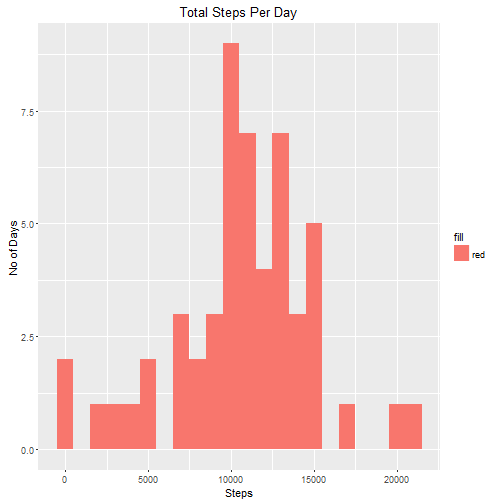
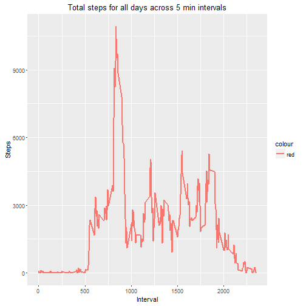
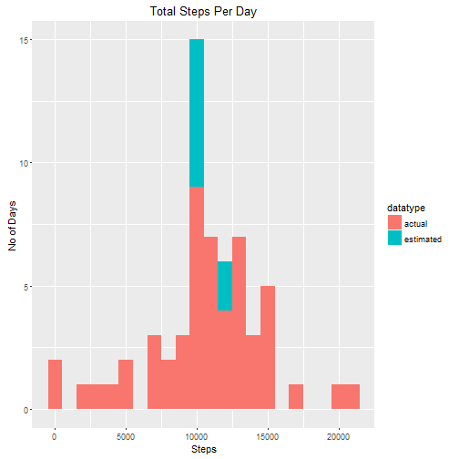
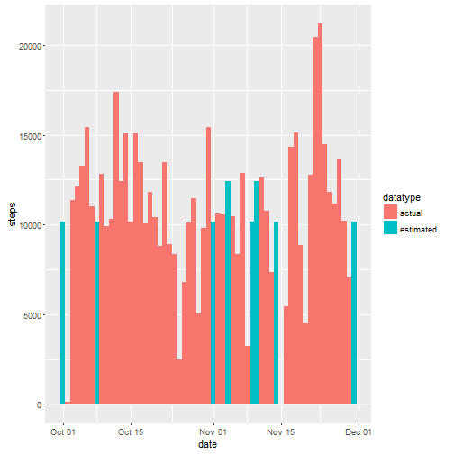
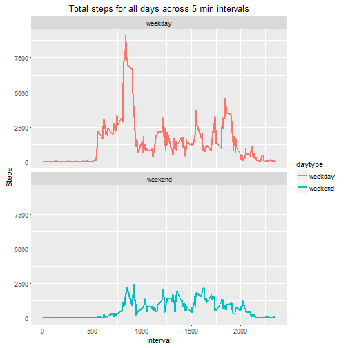

## Loading and preprocessing the data
1. Download the data file if it is not existing
2. Load the data (i.e. read.csv())
3. Process/transform the data (if necessary) into a format suitable for your analysis
4. The date column is convereted from character to a date. Also another column is added to the data frame to indicate a weekday/weekend.


```r
## Download the file and unzip the file

ActivityMonitoringDataFile="ActivityMonitoringData.zip" 
fileURL <-  "https://d396qusza40orc.cloudfront.net/repdata%2Fdata%2Factivity.zip"
if (!file.exists(ActivityMonitoringDataFile)) {
  download.file(fileURL ,ActivityMonitoringDataFile )
  unzip(ActivityMonitoringDataFile)
}
 
library(lubridate)
```

```
## 
## Attaching package: 'lubridate'
```

```
## The following object is masked from 'package:base':
## 
##     date
```

```r
library(ggplot2)
library(dplyr)
```

```
## 
## Attaching package: 'dplyr'
```

```
## The following objects are masked from 'package:lubridate':
## 
##     intersect, setdiff, union
```

```
## The following objects are masked from 'package:stats':
## 
##     filter, lag
```

```
## The following objects are masked from 'package:base':
## 
##     intersect, setdiff, setequal, union
```

```r
## Read the file
activity.data.all <- read.csv( "activity.csv",
                               header = TRUE, 
                               sep = ',', 
                               colClasses = c("numeric", "character", "integer")
                              )

activity.data.all$date <- ymd(activity.data.all$date)
activity.data.all <- mutate(activity.data.all, daytype =   ifelse(wday(activity.data.all$date) == 7 | wday(activity.data.all$date) == 1, "weekend", "weekday")  )
```

## What is mean total number of steps taken per day?

For this part of the assignment, you can ignore the missing values in the dataset.

1. Calculate the total number of steps taken per day
2. Make a histogram of the total number of steps taken each day
3. Calculate and report the mean and median of the total number of steps taken per day


```r
steps.per.day <- activity.data.all %>%
                 filter(!is.na(steps))%>%
                 group_by(date) %>%
                 summarize( steps = sum(steps))

mean.steps <- mean(steps.per.day$steps)
median.steps <- median(steps.per.day$steps)
median.steps                 
```

```
## [1] 10765
```

```r
g <- ggplot(data= steps.per.day, aes(x=steps, fill="red")) 
g <- g + geom_histogram(binwidth =1000 ) + 
         xlab("Steps") + 
         ylab ("No of Days ") +
         ggtitle("Total Steps Per Day") 

   
print(g)  
```



Mean number of steps

```r
mean.steps
```

```
## [1] 10766.19
```
Median  number of steps

```r
median.steps
```

```
## [1] 10765
```


## What is the average daily activity pattern?


1. Make a time series plot (i.e. type = "l") of the 5-minute interval (x-axis) and the average number of steps taken, averaged across all days (y-axis)
2. Which 5-minute interval, on average across all the days in the dataset, contains the maximum number of steps?


```r
steps.per.5minIntervals <- activity.data.all %>%
  filter(!is.na(steps))%>%
  group_by(interval) %>%
  summarize( steps = sum(steps))


g1 <- ggplot(steps.per.5minIntervals,
            aes(x=interval,
                y=steps,
                color="red")
) 
g1 <- g1 + 
  geom_line(lwd=1) + 
  xlab("Interval") + 
  ylab ("Steps") +
  ggtitle("Total steps for all days across 5 min intervals") 

print(g1)
```



Interval with maximum steps

```r
index <- which.max(steps.per.5minIntervals$steps)
steps.per.5minIntervals[  index ,  ]
```

```
## Source: local data frame [1 x 2]
## 
##   interval steps
##      (int) (dbl)
## 1      835 10927
```

## Imputing missing values
Note that there are a number of days/intervals where there are missing values (coded as NA). The presence of missing days may introduce bias into some calculations or summaries of the data.

1. Calculate and report the total number of missing values in the dataset (i.e. the total number of rows with NAs)
2. Devise a strategy for filling in all of the missing values in the dataset. The strategy does not need to be sophisticated. For example, you could use the mean/median for that day, or the mean for that 5-minute interval, etc.
3. Create a new dataset that is equal to the original dataset but with the missing data filled in.
4. Make a histogram of the total number of steps taken each day and Calculate and report the mean and median total number of steps taken per day. Do these values differ from the estimates from the first part of the assignment? What is the impact of imputing missing data on the estimates of the total daily number of steps?


```r
sum(is.na(activity.data.all$steps))
```

```
## [1] 2304
```

```r
steps.mean.5minIntervals <- activity.data.all %>%
  filter(!is.na(steps))%>%
  group_by(interval, daytype) %>%
  summarize( steps = mean(steps))


activity.data.good <- activity.data.all[!is.na(activity.data.all$steps),]
activity.data.good <- mutate(activity.data.good, datatype = "actual")

activity.data.nas <- activity.data.all[is.na(activity.data.all$steps),]
activity.data.nas<- merge(activity.data.nas, steps.mean.5minIntervals , by =c("interval", "daytype")) 
activity.data.nas <-activity.data.nas[, c(5,4,1,2)]
colnames(activity.data.nas) <- c("steps", "date", "interval", "daytype")
activity.data.nas <- mutate(activity.data.nas, datatype = "estimated")


activity.data.good <- rbind(activity.data.good,activity.data.nas)

steps.per.day.imputed <- activity.data.good %>%
  filter(!is.na(steps))%>%
  group_by(date,datatype) %>%
  summarize( steps = sum(steps))


g2 <- ggplot(data= steps.per.day.imputed, aes(x=steps, fill=datatype)) 
g2 <- g2 + geom_histogram(binwidth =1000 ) + 
  xlab("Steps") + 
  ylab ("No of Days ") +
  ggtitle("Total Steps Per Day") 

print(g2)       
```



Bar plot to show the information of the steps at a daily level


```r
g2 <- ggplot(steps.per.day.imputed,
             aes( x=date, 
                  y=steps, 
                  fill=datatype
             )
)
g2 <- g2 + geom_bar(stat= "identity", width = 1)

print(g2)
```


Mean number of steps

```r
mean(steps.per.day.imputed$steps)
```

```
## [1] 10762.05
```
Median  number of steps

```r
median(steps.per.day.imputed$steps)
```

```
## [1] 10571
```
## Are there differences in activity patterns between weekdays and weekends?

For this part the weekdays() function may be of some help here. Use the dataset with the filled-in missing values for this part.

1. Create a new factor variable in the dataset with two levels - "weekday" and "weekend" indicating whether a given date is a weekday or weekend day.
2. Make a panel plot containing a time series plot (i.e. type = "l") of the 5-minute interval (x-axis) and the average number of steps taken, averaged across all weekday days or weekend days (y-axis). See the README file in the GitHub repository to see an example of what this plot should look like using simulated data.


```r
steps.per.5minIntervals.daytype <- activity.data.all %>%
  filter(!is.na(steps))%>%
  group_by(interval, daytype) %>%
  summarize( steps = sum(steps))


g3 <- ggplot(steps.per.5minIntervals.daytype,
             aes(x=interval,
                 y=steps,
                 color= daytype)
) 
g3 <- g3+ 
  geom_line(lwd=1) + 
  xlab("Interval") + 
  ylab ("Steps") +
  ggtitle("Total steps for all days across 5 min intervals") +
  facet_wrap(~daytype, ncol=1)
print(g3)
```



